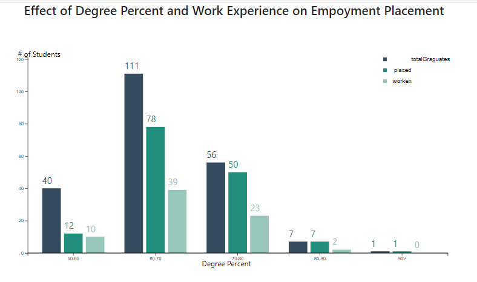

Just played with some data from Kaggle using JS, HTML and CSS


## To run

```sh
# clone this repository
$ git clone https://github.com/Sashanity/D3.js-project.git
```

```sh
# install http server
$ npm i -g http-server 
```
```sh
# run from the project folder
$ http-server &
```

[Data] (https://www.kaggle.com/benroshan/factors-affecting-campus-placement)